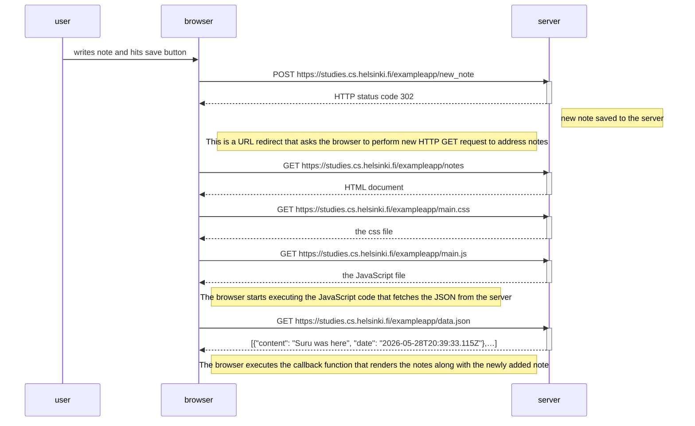

```mermaid

sequenceDiagram
    participant user
    participant browser
    participant server
    user->>browser: writes note and hits save button
    browser->>server:POST https://studies.cs.helsinki.fi/exampleapp/new_note
    activate server
    server-->>browser:HTTP status code 302
    deactivate server

    Note right of server: new note saved to the server
    Note left of server: This is a  URL redirect that asks the browser to perform new HTTP GET request to address notes
    browser->>server: GET https://studies.cs.helsinki.fi/exampleapp/notes
    activate server
    server-->>browser: HTML document
    deactivate server

    browser->>server: GET https://studies.cs.helsinki.fi/exampleapp/main.css
    activate server
    server-->>browser: the css file
    deactivate server

    browser->>server: GET https://studies.cs.helsinki.fi/exampleapp/main.js
    activate server
    server-->>browser: the JavaScript file
    deactivate server

    Note right of browser: The browser starts executing the JavaScript code that fetches the JSON from the server

    browser->>server: GET https://studies.cs.helsinki.fi/exampleapp/data.json
    activate server
    server-->>browser:[{"content": "Suru was here", "date": "2026-05-28T20:39:33.115Z"},…]
    deactivate server

    Note right of browser: The browser executes the callback function that renders the notes along with the newly added note

```
