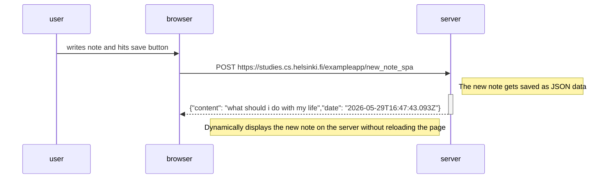

```mermaid
    sequenceDiagram
    participant user
    participant browser
    participant server
    user->>browser: writes note and hits save button
    browser->>server:POST https://studies.cs.helsinki.fi/exampleapp/new_note_spa

    note right of server: The new note gets saved as JSON data
    activate server
    server-->>browser: {"content": "what should i do with my life","date": "2026-05-29T16:47:43.093Z"}
    deactivate server
    note left of server: Dynamically displays the new note on the server without reloading the page


```
